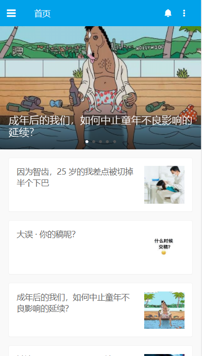
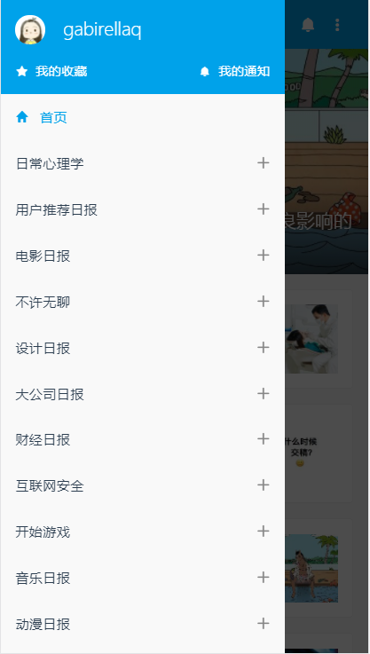
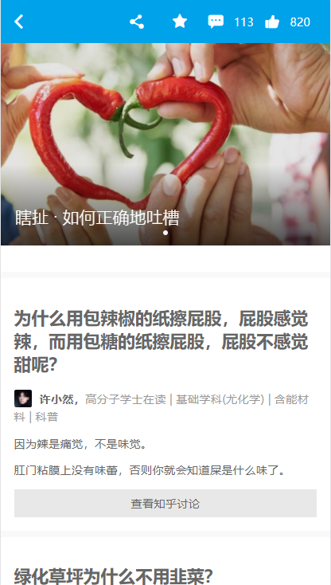
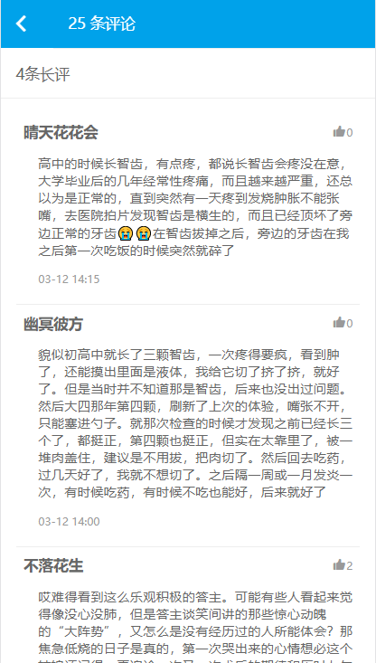

# zhihudaily

react + react-router-dom + react-redux

### 启动
```
npm install
npm start
```

### Server
> [API说明](https://github.com/izzyleung/ZhihuDailyPurify/wiki/%E7%9F%A5%E4%B9%8E%E6%97%A5%E6%8A%A5-API-%E5%88%86%E6%9E%90)


### 特性
* react
* react-router-dom
* react-redux
* swiper

### 功能
* 首页
* 侧边栏
* 新闻详细
* 评论

### 截图



